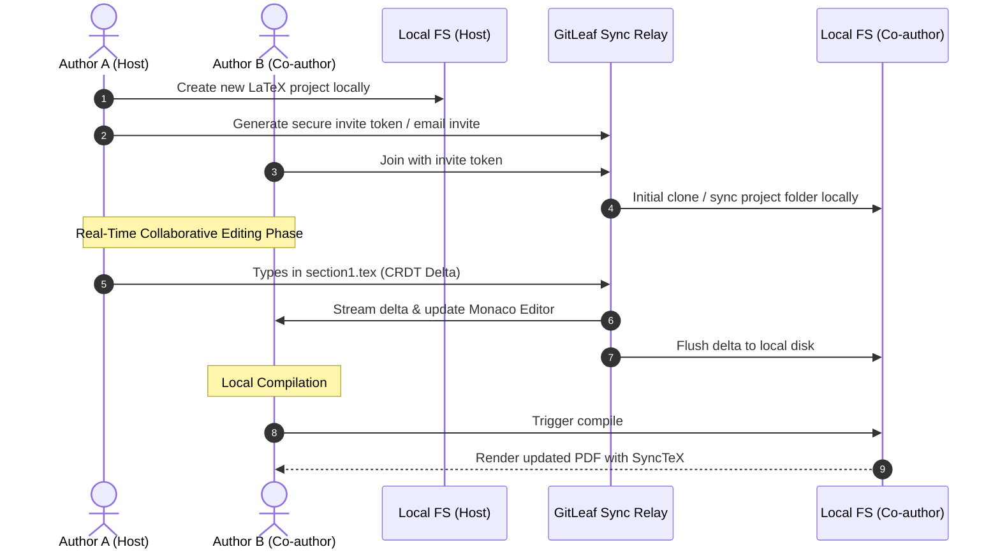

# 🍃 GitLeaf

<div align="center">


### **The Open-Source, Local-First, Collaborative LaTeX Platform**
*No Subscriptions. Unlimited Co-Authors. Git-Powered History. Stored On Your Machine.*

[](https://opensource.org/licenses/MIT)
[](https://www.typescriptlang.org/)
[](https://react.dev/)
[](https://localfirstweb.dev/)
[](#)

[Overview](#-why-gitleaf) •
[Features](#-key-features) •
[Architecture](#-architecture) •
[Quick Start](#-quick-start) •
[How It Works](#-how-it-works) •
[Roadmap](#-roadmap) •
[Contributing](#-contributing)

</div>

---

## 🚀 Why GitLeaf?

Writing scientific papers with co-authors shouldn't be gated behind paywalls or vendor lock-in. Traditional online LaTeX editors limit free collaboration to just **2 authors**, enforce cloud-only storage, and keep your valuable research locked away on third-party servers.

**GitLeaf** gives you the best of both worlds:
1. **The sleek, instant real-time editing and live PDF preview of Overleaf.**
2. **The sovereignty, offline speed, privacy, and version history of Git and your local filesystem.**

When you create a project in GitLeaf, files reside directly in your local directory. When you invite team members via email or share tokens, the project mirrors to their local machines with real-time multi-cursor sync and full version history.

---

## ✨ Key Features

| Feature | GitLeaf (Free & Local) | Commercial Cloud Editors |
| :--- | :---: | :---: |
| **Co-Author Limit** | **Unlimited (Free)** | 1–2 on Free Tier ($$$ for more) |
| **Storage Location** | **Your Local Machine (100% Owned)** | Closed Cloud Server |
| **Offline Editing** | **Full Local Support** | ❌ None / Read-only |
| **Real-Time Live Collaboration** | **CRDT Multi-Cursor Sync** | Subscription Paywall |
| **Version History** | **Native Git-Powered Timeline** | Paywalled / Limited |
| **LaTeX Compilation** | **Local TeX Live / Tectonic / WASM** | Queue-based Remote Server |
| **SyncTeX Bidirectional Jump** | **Native Click-to-Jump** | Standard |

### 💎 Core Highlights

- **📂 Local-First File Ownership**: Projects are regular folders on your SSD. Open them with VS Code, Vim, or GitLeaf seamlessly.
- **⚡ Instant Real-Time Multi-Cursor Collaboration**: Powered by Conflict-free Replicated Data Types (CRDTs) and high-speed peer relays.
- **📜 Git-Native Timeline & Time Travel**: Every edit creates transparent snapshots, visual diffs, and Git-compatible checkpoints.
- **🔨 Flexible Compilation Engine**:
  - Direct local compilation using your installed TeX engine (`pdflatex`, `xelatex`, `lualatex`, `tectonic`).
  - Zero-install WebAssembly in-browser fallback.
- **👁️ Split-View Live PDF Preview**: High-fidelity PDF rendering with bidirectional SyncTeX support (click code to jump to PDF, click PDF to jump to line).
- **✉️ Seamless Co-Author Invitations**: Pair laptops securely using one-click invite codes or email tokens.
- **🎨 Modern Dark & Light Aesthetic**: Monaco editor with LaTeX syntax highlighting, code completion, snippet expansions, and intelligent error diagnostics.

---

## 🏛️ Architecture

```
┌─────────────────────────────────────────────────────────────────────────────┐
│                             GitLeaf Client UI                               │
│  ┌──────────────────────────────┬────────────────────────────────────────┐  │
│  │ Monaco LaTeX Editor          │ High-Performance PDF Viewer            │  │
│  │ • Syntax & Snippets          │ • PDF.js + Canvas Render               │  │
│  │ • Multi-Cursor Awareness     │ • SyncTeX Bidirectional Navigation     │  │
│  │ • Inline Error Diagnostics   │ • Continuous Auto-Compilation View     │  │
│  └──────────────────────────────┴────────────────────────────────────────┘  │
└──────────────────────────────────────┬──────────────────────────────────────┘
                                       │
                ┌──────────────────────┴──────────────────────┐
                ▼                                             ▼
┌──────────────────────────────────────┐    ┌──────────────────────────────────┐
│        Local Project Engine          │    │     Distributed Sync & Mesh      │
│  • Local Filesystem Mirroring        │    │  • CRDT Real-Time Document Sync  │
│  • Local TeX Live / Tectonic Runner  │    │  • P2P / WebSocket Relay Mesh    │
│  • Fast Log Parser & Error Linter    │    │  • Git Snapshots & Branch Diffs  │
│  • SyncTeX Map Generator             │    │  • End-to-End Encrypted Handshake│
└──────────────────────────────────────┘    └──────────────────────────────────┘
```

---

## 🔄 How It Works



1. **Host Project**: Author A starts a project. GitLeaf stores the raw `.tex`, `.bib`, and image assets in a local folder.
2. **Invite Co-Authors**: Author A clicks *"Share"* and sends an invite code or email to Author B.
3. **Local Replication**: Author B accepts. The project is mirrored to Author B's machine.
4. **Live Synchronization**: Both authors edit simultaneously with real-time cursor indicators. Edits are merged conflict-free and written to disk.
5. **Compile & Review**: Either author can compile locally at native hardware speed with instant PDF preview and error navigation.

---

## ⚡ Quick Start

### Prerequisites
- [Node.js](https://nodejs.org/) (v18 or newer)
- *(Optional for full offline local compilation)*: TeX Live / MacTeX / MikTeX or [Tectonic](https://tectonic-typesetting.github.io/)

### Installation

```bash
# 1. Clone the repository
git clone https://github.com/CodeNebula-Dev/GitLeaf.git

# 2. Enter directory
cd GitLeaf

# 3. Install dependencies
npm install

# 4. Launch GitLeaf
npm run dev
```

Visit `http://localhost:5173` to open your local workspace.

---

## 🗺️ Roadmap

- [x] **Phase 1: Project Architecture & Branding** (Core design & blueprint)
- [ ] **Phase 2: Local Project Engine & UI**
  - [ ] Monaco LaTeX editor integration with custom theme
  - [ ] Local filesystem provider & project directory switcher
  - [ ] Fast PDF.js preview with SyncTeX jumping
- [ ] **Phase 3: LaTeX Compiler Integration**
  - [ ] Local system TeX runner (`pdflatex`, `latexmk`, `tectonic`)
  - [ ] Real-time log parser & jump-to-error diagnostics
  - [ ] In-browser WebAssembly TeX fallback
- [ ] **Phase 4: Real-Time P2P / Mesh Sync (CRDTs)**
  - [ ] Yjs-based collaborative document buffer
  - [ ] Multi-author cursor presence & colored badges
  - [ ] Secure pairing token & email invite workflow
- [ ] **Phase 5: Git-Native History & Branching**
  - [ ] Automated checkpointing & commit history graph
  - [ ] Visual side-by-side file diffs
  - [ ] Rollback & time-travel slider
- [ ] **Phase 6: Desktop App Packaging (Electron / Tauri)**

---

## 🛠️ Tech Stack

- **Frontend**: React, TypeScript, Tailwind CSS / Vanilla CSS Design System, Lucide Icons
- **Editor**: Monaco Editor (`monaco-editor`) + LaTeX Language Extension
- **PDF & Preview**: PDF.js, SyncTeX Parser
- **Collaboration**: Yjs, WebRTC, WebSocket Signaling Relay
- **Backend / Engine**: Node.js, Express / Fastify, local process spawners for TeX engines
- **Version Control**: isomorphic-git / native git bindings

---

## 🤝 Contributing

Contributions from researchers, developers, and typography enthusiasts are warmly welcomed!

1. Fork the Project
2. Create your Feature Branch (`git checkout -b feature/AmazingFeature`)
3. Commit your Changes (`git commit -m 'Add some AmazingFeature'`)
4. Push to the Branch (`git push origin feature/AmazingFeature`)
5. Open a Pull Request

---

## 📄 License

Distributed under the **MIT License**. See `LICENSE` for more information.

<div align="center">
Made with ❤️ by <a href="https://github.com/CodeNebula-Dev">CodeNebula-Dev</a> & the Open Source Community.
</div>
